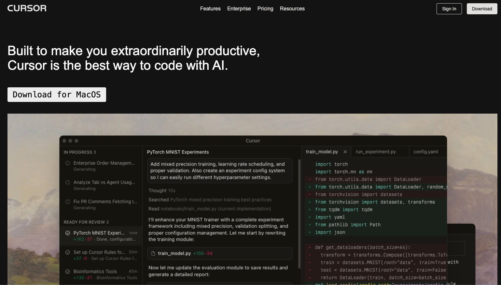
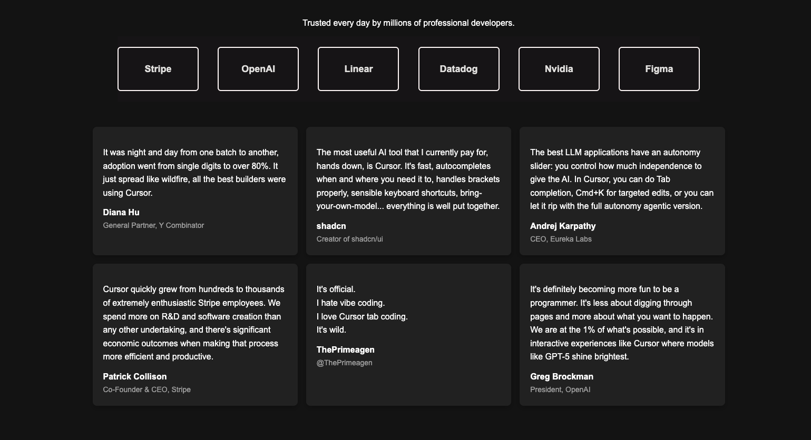

# Cursor.ai Landing Page Clone

This project is a clone of the Cursor.ai landing page, created using only HTML and CSS. The aim of this project is to replicate the design and provide a visually appealing, responsive layout.

## Table of Contents

- [Overview](#overview)
- [Features](#features)
- [Technologies Used](#technologies-used)
- [How to Use](#how-to-use)
- [Screenshots](#screenshots)
- [Acknowledgements](#acknowledgements)

## Overview

This project replicates the clean and modern design of the Cursor.ai landing page. It consists of a responsive layout with smooth hover effects, well-structured content sections, and an aesthetic UI. 

The project was created as part of the Chai and Code Web Dev Cohort.

## Features

- **Navigation Bar**: Responsive navigation bar with hover effects.
- **Call-to-Action Buttons**: Includes "Sign In" and "Download" buttons with interactive hover states.
- **Testimonial Section**: Displays user testimonials in a responsive grid layout.
- **Footer**: A minimalist footer with important links and information.

## Technologies Used

- **HTML5**
- **CSS3**
  - Flexbox for layout
  - CSS Grid
  - Smooth transitions/hover effects

## How to Use

1. Clone the repository or download the files:
   ```bash
   git clone https://github.com/undersolved/cursor-landing-clone.git
   ```
2. Navigate to the project directory:
   ```bash
   cd cursor-landing-clone
   ```
3. Open the `landing-page.html` file in your browser to view the webpage.

## Screenshots

Here are some screenshots of the project:

### Screenshot 1


### Screenshot 2


## Acknowledgements

This project was inspired by the **[Cursor.ai](https://www.cursor.ai/)** landing page. Created as a part of the **Chai and Code Web Dev Cohort** to improve web development skills.

--- 
Feel free to contribute or create a pull request. 😊